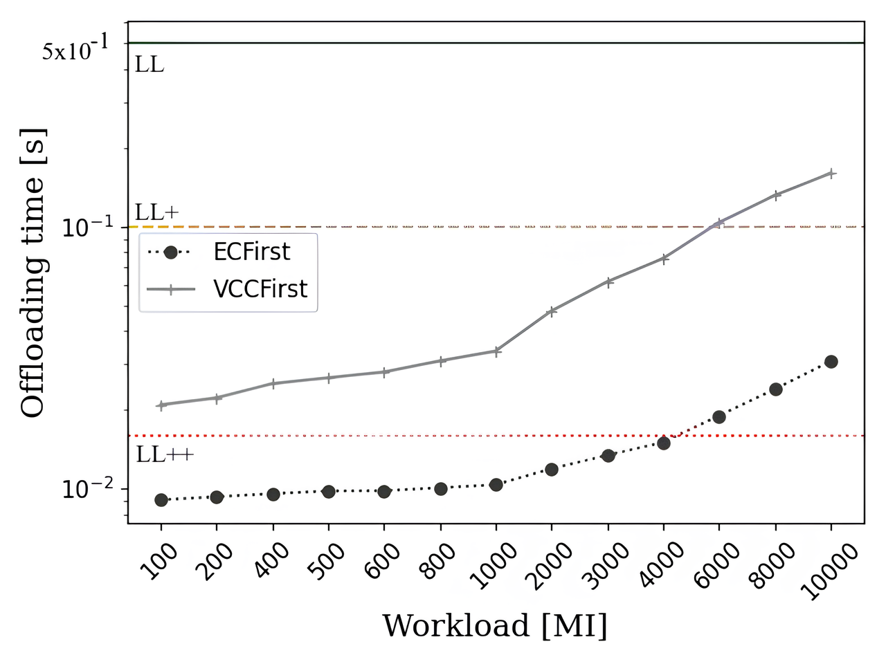

# Vehicular Cloud Computing: A Cost-Effective Alternative to Edge Computing in 5G Networks

This repository contains figures from our research paper investigating whether Vehicular Cloud Computing (VCC) can effectively replace Edge Computing (EC) for low-latency applications in 5G networks.

For full details and methodology, please refer to [our paper](https://papers.ssrn.com/sol3/papers.cfm?abstract_id=5074972).

These figures have been generated by analyzing trace data from NS3 simulations and processed using Python for visualization.

## Architecture

  

**Description**: This figure illustrates our proposed communication architecture, showing the integration of 5G networks with Vehicular Cloud Computing. The system includes end-users with UEs, vehicles with computational resources, a gNodeB (5G Base Station), an Edge server at the SGW, and Cloud resources. The Controller in the gNodeB manages task offloading decisions based on available vehicular resources, network conditions, and application requirements.

## Figures and Key Findings

### Figure 2: Impact of Number of End-Users

  

**Description**: Shows average offloading time for ECFirst and VCCFirst strategies with different request rates and varying numbers of users.

**Findings**: VCC can satisfy LL+ and LL requirements for 1-100 users. For extremely low latency (LL++), EC is still required. The 5G network maintains high performance even with increasing users thanks to its large capacity.

### Figure 3: Offloading Time Components

  

**Description**: Breakdown of offloading time components (uplink, elaboration, downlink) in VCCFirst scenario.

**Findings**: Uplink and downlink times contribute similarly to total offloading time. Elaboration time makes a slightly smaller contribution, indicating well-balanced resource allocation.

### Figure 4: Impact of Task Workload
<table align="center">
  <tr>
    <td></td>
    <td></td>
  </tr>
  <tr align="center">
    <td><b>(a) ECFirst and VCCFirst offloading time</b></td>
    <td><b>(b) The VCC offloading time for the VCCFirst strategy</b></td>
  </tr>
</table>

**Description**: Two subfigures showing (a) offloading time comparison between strategies and (b) detailed breakdown of VCC offloading components for different workloads.

**Findings**: EC can satisfy LL++ requirements up to 4000 MI. VCC meets LL+ and LL requirements for workloads up to 6000 MI. After 6000 MI, VCC can still fulfill LL requirements while EC satisfies LL+ and LL.

### Figure 5: Impact of Number of Vehicles

  

**Description**: Shows offloading time in VCCFirst scenario with different number of vehicles, including percentile distributions.

**Findings**: More vehicles improve response time and reduce reliance on cloud computing. From 10 vehicles onwards, cloud usage becomes negligible. The 90th, 95th, and 99th percentiles get closer to the average as vehicle numbers increase, indicating reduced variability.

### Figure 6: Impact of Computational Resources

  

**Description**: Shows impact of varying computational resources in vehicles.

**Findings**: Increasing resources beyond the ARM Cortex A73 capacity provides diminishing returns as communication time (uplink and downlink) dominates the overall offloading time.

### Figure 7: Impact of Vehicle Speed

  

**Description**: Shows failure rates at different vehicle speeds, with color-coded breakdown of failure causes.

**Findings**: Failure rate increases with vehicle speed, primarily due to connection issues between gNodeB and vehicles. Total failure rate remains below 4%, showing the system's robustness even at high speeds.

### Figure 8 & 9: Cost Analysis
<table align="center">
  <tr>
    <td></td>
    <td></td>
  </tr>
  <tr align="center">
    <td><b>Figure 8: Total cost comparison (normal usage)</b></td>
    <td><b>Figure 9: Total cost comparison (1% of total offloading requests)</b></td>
  </tr>
</table>

**Description**: Comparison of total costs between EC and VCC for different operational periods and usage scenarios.

**Findings**: VCC is more cost-effective than EC even in conservative scenarios. The cost gap is primarily due to CAPEX and maintenance costs of EC deployment. VCC remains a safer and more economical investment even with variable offloading request volumes.

## Conclusion

The figures demonstrate that VCC can effectively replace EC for low-latency applications, with failure rates below 4% even in high-mobility scenarios. The cost analysis shows significant savings for network operators. EC remains necessary only for extremely low latency applications (below 16ms).

